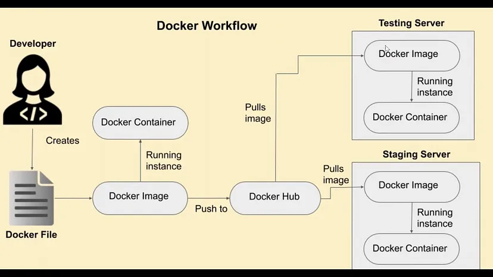
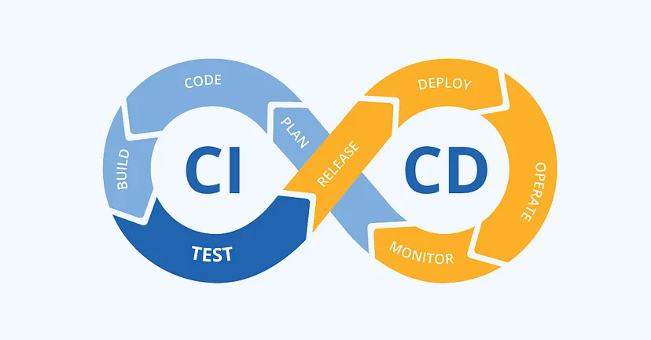
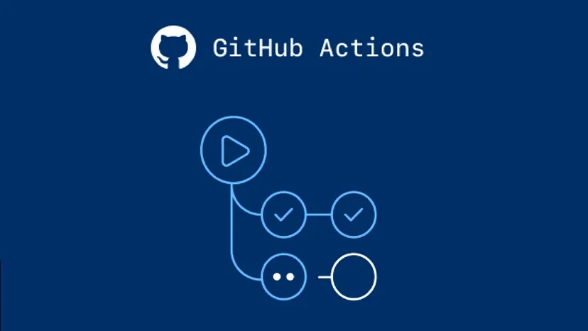
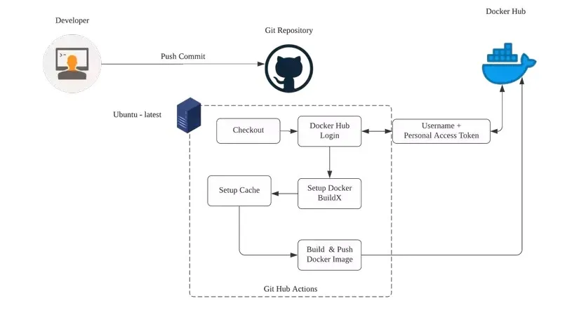

# Dockerize Spring-boot with Github-Actions

- This Blog article demonstrates a complete Docker CI/CD pipeline for a Spring Boot application using GitHub Actions.

- The pipeline automates the build, and Dockerization processes to ensure consistent and reliable delivery of the application.

## ⚡ 1. Understanding Docker



Think of Docker as a shipping container for software.

- A shipping container can carry different types of goods (furniture, electronics, clothes) across different modes of transport (ships, trains, trucks) without any changes to the container itself.

- A Docker container carries all the parts needed to run an application (code, libraries, settings) across different computing environments (developer’s laptop, testing server, production cloud) without any changes to the container itself.

Finally, Docker is an open-source platform that enables developers to automate the deployment, scaling, and management of applications in lightweight, portable containers. Containers package an application and its dependencies together, ensuring that it runs consistently across different computing environments.

Benefits of Using Docker:

- This ensures that the application behaves the same way in development, testing, and production environments.

- With Docker, dependencies required for an application to run are packaged within the container. This eliminates conflicts between dependencies on the host system and allows different versions of dependencies to coexist peacefully.
  
- With Docker, dependencies required for an application to run are packaged within the container. This eliminates conflicts between dependencies on the host system and allows different versions of dependencies to coexist peacefully.

- Docker supports microservices-based applications, where each service can be packaged and deployed independently in its own container.

- Docker images are versioned, allowing developers to roll back to previous versions or track changes easily.

- Docker facilitates automation in CI/CD pipelines by providing consistent environments for testing, deployment, and production.

Key Components of Docker

- **Image**: An image is a read-only template used to create containers. Think of it as a snapshot of your application at a particular point in time.

- **Container**: A container is like a lightweight, portable, and self-sufficient unit that contains everything needed to run an application. A Docker container is a runnable instance of an image.

- **Dockerfile**: A Dockerfile is a script containing a series of commands used to assemble an image. It tells Docker how to build the image step by step.

- **Docker Hub**: A public registry where Docker images are stored and shared. Developers can push their images to Docker Hub or pull and run images created by others.

- **Docker Engine**: The core of Docker, it is the runtime that builds and runs containers using images. It includes the Docker Daemon and Docker Client.

- **Docker Daemon**: A background service running on the host machine. It manages Docker objects such as images, containers. The Docker Daemon listens for Docker API requests and processes them.

- **Docker Client**: A command-line tool that allows users to interact with the Docker Daemon. When you type a Docker command, the client sends these commands to the Docker Daemon via the Docker API.

- **Docker Desktop (Windows/Mac)**: A user-friendly application that includes Docker Engine, Docker Client, Docker Compose, and other features.

## ⚡ 2. Setting Up Your Environment

### 2.1. Installing Docker

- Follow the instructions for your operating system on the <a href="https://docs.docker.com/get-docker/">official website</a> of docker.

- After installation, verify the installation by checking the version.

```bash
docker version
```

### 2.2. Create a spring boot application

- Generate a new project using <a href="https://start.spring.io/">spring initializer</a>.

- Create a simple REST controller.

```java
@RestController
public class HelloController {

    @GetMapping("/welcome")
    public String welcome() {
        return "Let's learn Docker!";
    }
}
```

- Run the application to make sure that the application works fine on local. Open your web browser and go to http://localhost:8080/welcome. You should see the message “Let’s learn Docker!”.

## ⚡ 3. Dockerizing the Spring Boot Application


### 3.1. Creating a Dockerfile

As I mentioned earlier, A Dockerfile is a script that contains a series of instructions on how to build a Docker image for your application.

Each instruction in a Dockerfile creates a layer in the image, making it possible to efficiently reuse layers that haven’t changed.

Create Dockerfile in the root directory.

```dockerfile
# Dockerfile

# Use a base image containing Java runtime
FROM openjdk:17-jdk-alpine # Replace with your desired JDK version

# Set the working directory inside the container
WORKDIR /app

# Copy the Spring Boot jar file into the container
COPY target/spring-boot-docker-example.jar /app/spring-boot-docker-example.jar

# Expose the port that the Spring Boot application runs on
EXPOSE 8080

# Run the Spring Boot application
ENTRYPOINT ["java", "-jar", "/app/spring-boot-docker-example.jar"]
```

The JAR (Java ARchive) file is the compiled and packaged version of your Java application. It contains all the compiled Java classes, resources, and libraries needed to run your Spring Boot application.

Set the finalName in the build section of your pom.xml to the name of the jar file. This setting ensures that the JAR file generated will be named spring-boot-docker-example.jar.

```xml
<build>
    <finalName>spring-boot-docker-example</finalName>
</build>
```

### 3.2. Building the Project

```
mvn clean install
```

### 3.3. Building the Docker Image

To build the Docker image, navigate to the root directory and run the following command:

```
docker build -t spring-boot-docker-example:v1.0 .
```

`spring-boot-docker-example`: This is the name you want to give to your Docker image.

`v1.0 `: This is the tag you want to assign to the image. Tags allow you to differentiate between different versions or variants of an image.

`.`: Location to the dockerfile from the the root directory.

To Verify that the docker image is created, run below command, which lists all available images.

```
docker images
```

### 3.4. Running the Docker Container

To run a container from the built image, use the `docker run` command:

```
docker run -p 8080:9000 spring-boot-docker-example:v1.0
```

`8080`: This is the port number on your host machine where you want to map the container port.

`9000`: This is the port number inside the Docker container that your application is listening on.

Requests to `localhost:8080` on your host machine are forwarded to port `9000` inside the Docker container where your Spring Boot application is running.

Now, you can access this application from your web browser on `http://localhost:8080`.


To Verify that your application is running inside a Docker container, run docker ps command, which lists all running containers.

```
docker ps
```

To list all the containers (Running and Stopped), run below command.

```
docker ps -a 
```

### 3.5. Pushing Docker Images to Docker Hub

Log in to Docker Hub. Sign up for a free account if you don’t already have one.

Create a New Repository. Click on the “Create Repository” button on the Docker Hub dashboard. Enter a name for your repository. For example, spring-boot-docker-example-repo. Optionally, provide a description and set the visibility (public or private). Click on the “Create” button to create your repository.

Once you have your Docker Hub account and repository set up, you can push your Docker image to Docker Hub.

Tag your local Docker image with the repository name on Docker Hub. Use the format `<username>/<repository-name>:<tag>`.

```
docker tag spring-boot-docker-example:v1.0 yourusername/spring-boot-docker-example-repo:v1.0
```

Push the tagged image to Docker Hub using docker push .

```
docker push yourusername/spring-boot-docker-example-repo:v1.0
```

After pushing, you can verify the image on Docker Hub by logging into Docker Hub, navigating to your repository `(yourusername/spring-boot-docker-example-repo)`, and checking the "Tags" tab to see the pushed image.

### 3.6. Pulling Docker Images from Docker Hub

Once your Docker image is pushed to Docker Hub, others can pull and run it on any Docker-enabled environment.

On the machine where you want to run your Docker container, pull the image from Docker Hub.

```
docker pull yourusername/spring-boot-docker-example-repo:v1.0
```

Run the pulled image as a container using docker run .

```
docker run -p 8080:9000 yourusername/spring-boot-docker-example-repo:v1.0
```

Open your web browser and navigate to http://localhost:8080 to access your Spring Boot application running inside the Docker container.


## ⚡ 4. Continuous Integration and Deployment (CI/CD) with Docker and GitHub actions.

### 4.1. Understanding CI/CD




1. **Continuous Integration**: CI is a practice in software development where developers frequently integrate (merge) their code changes into a shared repository.

- You write new code for a feature.
- You push your code to the shared repository.
- Automated tests run to check if your code works.
- If tests pass, the code is merged. If not, you fix the issues and push again.
  
2. **Continuous Deployment**: CD is a practice where code changes are automatically deployed (released) to a production environment after they pass CI stage.

- Once the code is merged and all tests pass, the CI system builds a new version of the application.
- The new version is automatically deployed to a live server where users can access it.
- The system monitors the deployment to ensure everything works smoothly.

### 4.2. Understanding GitHub Actions



Traditionally, if we’re using Docker without automation tools like GitHub Actions, we would indeed need to manually build our application, create a Docker image, and push it to a Docker registry (like Docker Hub) every time we make changes to our code.

GitHub Actions is a way to automate these processes.

With GitHub Actions, we can define workflows in YAML files that specify what actions to take when certain events happen (e.g., pushing to a specific branch).

By this way, we can automate tasks like building our application, running tests, building Docker images, pushing them to Docker Hub, and even deploying to a server or cloud platform.

Automating Tasks with GitHub Actions saves time, reduces manual effort and ensures that every code change triggers a consistent build and deployment process.

Firstly we have understood what CI/CD is. Now let’s explore some terminologies in github actions.

**Workflow**

A workflow is an automated process that you define in your GitHub repository.
It is made up of one or more jobs that can be triggered by an event.

Workflows are defined in YAML files located in the `.github/workflows` directory of your repository.

**Events**

Events are specific activities that trigger a workflow.
Common events include issues ,push, pull_request, release, and schedule.

```
on:
  push:
    branches:
      - main
```

**Jobs**

A job is a set of steps executed on the same runner.

Jobs can run in parallel or be dependent on other jobs.

Runners are servers that run your workflows when they’re triggered.

```
jobs:
  build: #Job 1
    runs-on: ubuntu-latest # Runner for Job 1
  
  test: # Job 2
    runs-on: ubuntu-latest # Runner for Job 2
    needs: build #test will only run if the build job completes successfully.
```

By default, jobs in a workflow run in parallel. You can control the order of execution using the `needs` keyword.

**Steps**

Steps are individual tasks within a job.

They can run commands, set up dependencies, or use actions.

Each step runs in its own process.

```
jobs:
  build: #Job 1
    runs-on: ubuntu-latest # Runner for Job 1
    
    steps: 
    # Step 1
    - name: Checkout code
      uses: actions/checkout@v2
    
    # Step 2
    - name: Set up JDK 11
      uses: actions/setup-java@v2
      with:
        java-version: '11'

    # Step 3
    - name: Build with Maven
      run: mvn clean install
```

**Actions**

Actions are reusable units of code that can be used to perform common tasks.

You can use actions created by the community or create your own. Actions can be used in steps with the uses keyword.

Example of using a pre-built action: Checkout

```
steps:
  - name: Checkout code
    uses: actions/checkout@v2
```

Example of creating an action by our own.

```
- name: Build with Maven
  run: mvn clean install
```

**Secrets**

Secrets are encrypted variables that you create in your repository to store sensitive information, such as API keys or login credentials.

Secrets are accessed in workflows using the secrets context.

```
- name: Login to dockerhub
  run: docker login -u ${{secrets.DOCKER_USERNAME}} -p ${{secrets.DOCKER_PASSWORD}} 
```

### 4.3. Writing GitHub Actions Workflow for Dockerization



Go to GitHub and create a new repository.

Add the created repository origin to your project.

In the root directory of our project, We have already created the `dockerfile`. So move on to next step.

In the root directory, create a directory for your GitHub Actions workflows.

```
mkdir .github/workflows
```

Create a workflow file named docker.yml in the `.github/workflows` directory.

```
# Name of the workflow
name: CI/CD Pipeline for Docker

# Define the events that trigger the workflow
on:
  push: # Trigger the workflow on push events
    branches:
      - main # Only trigger on pushes to the main branch
  pull_request: # Trigger the workflow on pull request events
    branches:
      - main # Only trigger on pull requests to the main branch

# Define the jobs to be run as part of the workflow
jobs:
  build:
    runs-on: ubuntu-latest # Specify the runner environment

    steps:
      - name: Checkout code # Step to checkout the repository code
        uses: actions/checkout@v2 # Use the pre-built checkout action

      - name: Set up JDK 17 # Step to set up Java Development Kit version 17
        uses: actions/setup-java@v2 # Use the pre-built setup-java action
        with:
          java-version: '17' # Specify the JDK version

      - name: Build with Maven # Step to build the project using Maven
        run: mvn clean install # Run the Maven clean and install commands

      - name: Login to Docker Hub # Step to log in to Docker Hub
        run: docker login -u ${{secrets.DOCKER_USERNAME}} -p ${{secrets.DOCKER_PASSWORD}}  # Login with secrets 

      - name: Build Docker image # Step to build the Docker image
        run: docker build -t yourusername/spring-boot-docker-example-repo:v1.0 . # Build the Docker image with the specified tag

      - name: Push Docker image # Step to push the Docker image to Docker Hub
        run: docker push yourusername/spring-boot-docker-example-repo:v1.0 # Push the Docker image with the specified tag
```

Let’s change the message of our endpoint.

```
@RestController
public class HelloController {

    @GetMapping("/welcome")
    public String welcome() {
        return "Let's learn Docker with GitHub actions!";
    }
}
```

For configuring the secrets, Go to your GitHub repository settings. Navigate to the “Secrets and variables” section and then to “Actions”. Add new repository secrets for`DOCKER_USERNAME` and `DOCKER_PASSWORD`.

Add, commit, and push your changes to GitHub.

```
git add .
git commit -m "Set up CI/CD with Docker and GitHub Actions"
git push origin main
```

Your GitHub Actions workflow will trigger automatically on every push or pull request to the main branch.

Go to the “Actions” tab in your GitHub repository.

You should see your workflow running.

Once the workflow completes, navigate to your Docker Hub account. Verify that the Docker image has been successfully pushed to your repository on Docker Hub.

Now open your terminal, and once again pull and run the image.

Open your web browser and navigate to `http://localhost:8080` to access your Spring Boot application running inside the Docker container.

With GitHub Actions, you no longer need to manually build and push your Docker image every time you make changes.

The workflow you set up automates the entire process. Every time you push code to the repository, GitHub Actions will build the Docker image and push it to Docker Hub for you.


We are done 🎉!
