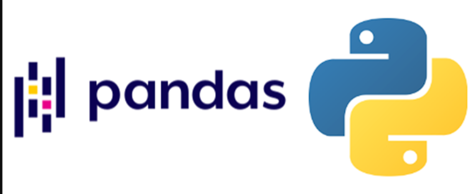

Pandas is a popular Python library used for data manipulation and analysis. It provides data structures and functions to efficiently handle structured data, making it a valuable tool for data scientists and analysts.

**Some key uses and applications of Pandas include:**

- Data cleaning and preprocessing: Pandas offers powerful tools for cleaning and transforming data, such as handling missing values, removing duplicates, and reshaping data.
- Data exploration and analysis: With Pandas, you can easily perform various data analysis tasks, such as filtering, sorting, grouping, and aggregating data. It also supports statistical operations and time series analysis.
- Data visualization: Pandas integrates well with other libraries like Matplotlib and Seaborn, allowing you to create insightful visualizations to better understand your data.

**Pros of using Pandas:**
- Easy data manipulation: Pandas provides a simple and intuitive API for handling data, allowing you to perform complex operations with just a few lines of code.
- Efficient performance: Pandas is built on top of NumPy, a high-performance numerical computing library. This makes Pandas fast and efficient, especially when working with large datasets.
- Wide range of functionality: Pandas offers a wide range of functions and methods for data manipulation, analysis, and visualization, making it a versatile tool for various data-related tasks.

**Cons of using Pandas:**
- Memory usage: Pandas can consume a significant amount of memory, especially when working with large datasets. It's important to be mindful of memory usage and optimize your code accordingly.
- Steep learning curve: While Pandas provides a powerful set of tools, it can have a steep learning curve, especially for beginners. It requires understanding of concepts like data frames, indexing, and data manipulation techniques.

**Future scope of Pandas:**
- Continual development: Pandas is an actively maintained library with a large community of contributors. It continues to evolve with new features and improvements, ensuring its relevance in the future.
- Integration with other libraries: Pandas is often used in conjunction with other libraries like scikit-learn and TensorFlow for machine learning and data analysis tasks. Its integration with these libraries will further enhance its capabilities.

In conclusion, Pandas is a versatile Python library for data manipulation and analysis, offering a wide range of functionality. While it has some limitations, its benefits outweigh the drawbacks, making it a valuable tool for data professionals.

