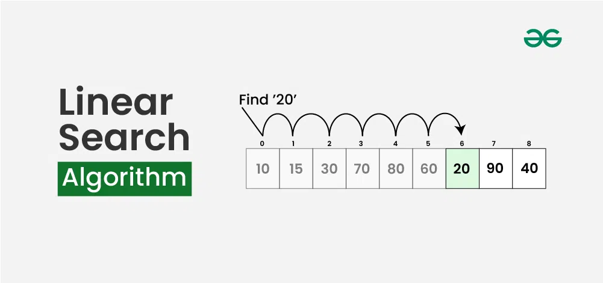

## What is Linear Search?

Linear Search is a simple search algorithm used to find the presence of a target element within a list. It sequentially checks each element of the list until the target element is found or the list ends.

## Algorithm for Linear Search

1. Start from the leftmost element of the list and move towards the right.
2. Compare the target element with each element of the list.
3. If the target element matches with an element, return the index.
4. If the target element does not match any element, return -1.

## How does Linear Search work?

- It starts from the first element and compares the target element with each element in the list.
- If a match is found, it returns the index of the matching element.
- If no match is found after checking all elements, it returns -1 indicating the target is not present in the list.


## Problem Description

Given a list and a target element, implement the Linear Search algorithm to find the index of the target element in the list. If the element is not present, return -1.

## Examples

**Example 1:**
```
Input:
list = [1, 3, 5, 7, 9]
target = 5
Output: 2
```

**Example 2:**
```
Input:
list = [2, 4, 6, 8, 10]
target = 7
Output: -1
```
## Your task

Complete the function search() which takes two integers n , k and an array arr, as input parameters and returns an integer denoting the answer. Return -1 if the number is not found in the array. You don't have to print answers or take inputs.

Expected Time Complexity: $O(n)$
Expected Auxiliary Space: $O(1)$

## Constraints

- $1 <= n <= 10^6$
- $1 <= k <= 10^6$
- $1 <= arr[i] <= 10^9$

## Implementation

<Tabs>
  <TabItem value="Python" label="Python" default>
  <SolutionAuthor name="@ngmuraqrdd"/>
  ```python
  def linear_search(lst, target):
      for i in range(len(lst)):
          if lst[i] == target:
              return i
      return -1
  ```
  </TabItem>

  <TabItem value="C++" label="C++">
  <SolutionAuthor name="@ngmuraqrdd"/>
  ```cpp
  #include <iostream>
  #include <vector>

  int linear_search(const std::vector<int>& lst, int target) {
      for (int i = 0; i < lst.size(); i++) {
          if (lst[i] == target) {
              return i;
          }
      }
      return -1;
  }

  int main() {
      std::vector<int> lst = {1, 3, 5, 7, 9};
      int target = 5;
      std::cout << "Index: " << linear_search(lst, target) << std::endl;
      return 0;
  }
  ```
  </TabItem>

  <TabItem value="Java" label="Java">
  <SolutionAuthor name="@ngmuraqrdd"/>
  ```java
  public class LinearSearch {
      public static int linearSearch(int[] lst, int target) {
          for (int i = 0; i < lst.length; i++) {
              if (lst[i] == target) {
                  return i;
              }
          }
          return -1;
      }

      public static void main(String[] args) {
          int[] lst = {1, 3, 5, 7, 9};
          int target = 5;
          System.out.println("Index: " + linearSearch(lst, target));
      }
  }
  ```
  </TabItem>

  <TabItem value="JavaScript" label="JavaScript">
  <SolutionAuthor name="@ngmuraqrdd"/>
  ```javascript
  function linearSearch(lst, target) {
      for (let i = 0; i < lst.length; i++) {
          if (lst[i] === target) {
              return i;
          }
      }
      return -1;
  }

  const lst = [1, 3, 5, 7, 9];
  const target = 5;
  console.log("Index:", linearSearch(lst, target));
  ```
  </TabItem>
</Tabs>

## Complexity Analysis

- **Time Complexity**: $O(n)$, where $n$ is the number of elements in the list. In the worst case, it will search through the entire list.
- **Space Complexity**: $O(1)$, as no extra space is required apart from the input list.

## Advantages and Disadvantages

**Advantages:**
- Simple and easy to implement.
- Does not require the list to be sorted.

**Disadvantages:**
- Inefficient for large lists as it has a linear time complexity.
- Better alternatives exist for sorted lists or when multiple searches are required.

## References

- **GFG Problem:** [GFG Problem](https://www.geeksforgeeks.org/linear-search/)
- **HackerRank Problem:** [HackerRank](https://www.hackerrank.com/challenges/linear-search/problem)
- **Author's Geeks for Geeks Profile:** [MuraliDharan](https://www.geeksforgeeks.org/user/ngmuraqrdd/)