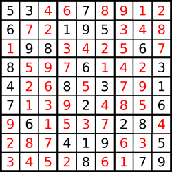

## Problem Description

| Problem Statement | Solution Link | LeetCode Profile |
| :---------------- | :------------ | :--------------- |
| [Sudoku Solver](https://www.geeksforgeeks.org/sudoku-backtracking-7/) | [Sudoku Solver Solution on LeetCode](https://leetcode.com/problems/sudoku-solver/) |  [DaminiChachane](https://leetcode.com/u/divcxl15/) |

## Problem Description

Steps to solve a problem Sudoku puzzle .

- Create a function that checks if the given matrix is valid sudoku or not. Keep Hashmap for the row, column and boxes. If any number has a frequency greater than 1 in the hashMap return false else return true;
- Create a recursive function that takes a grid and the current row and column index.
- Check some base cases. 
            - If the index is at the end of the matrix, i.e. i=N-1 and j=N then check if the grid is  safe or not, if safe print the grid and return true else return false. 
            - The other base case is when the value of column is N, i.e j = N, then move to next row, i.e. i++ and j = 0.
- If the current index is not assigned then fill the element from 1 to 9 and recur for all 9 cases with the index of next element, i.e. i, j+1. if the recursive call returns true then break the loop and return true.
- If the current index is assigned then call the recursive function with the index of the next element, i.e. i, j+1

 

### Examples

#### Example 1:

**Input**: board = 
```
[["5","3",".",".","7",".",".",".","."],["6",".",".","1","9","5",".",".","."],[".","9","8",".",".",".",".","6","."],["8",".",".",".","6",".",".",".","3"],["4",".",".","8",".","3",".",".","1"],["7",".",".",".","2",".",".",".","6"],[".","6",".",".",".",".","2","8","."],[".",".",".","4","1","9",".",".","5"],[".",".",".",".","8",".",".","7","9"]]
```

**Output**: 
```
[["5","3","4","6","7","8","9","1","2"],["6","7","2","1","9","5","3","4","8"],["1","9","8","3","4","2","5","6","7"],["8","5","9","7","6","1","4","2","3"],["4","2","6","8","5","3","7","9","1"],["7","1","3","9","2","4","8","5","6"],["9","6","1","5","3","7","2","8","4"],["2","8","7","4","1","9","6","3","5"],["3","4","5","2","8","6","1","7","9"]]
```

**Explanation**: The input board is shown above and the only valid solution is shown below:

#### Example 2:
**Input:** 

``{ {3, 0, 6, 5, 0, 8, 4, 0, 0},
{5, 2, 0, 0, 0, 0, 0, 0, 0},
{0, 8, 7, 0, 0, 0, 0, 3, 1},
{0, 0, 3, 0, 1, 0, 0, 8, 0},
{9, 0, 0, 8, 6, 3, 0, 0, 5},
{0, 5, 0, 0, 9, 0, 6, 0, 0}, 
{1, 3, 0, 0, 0, 0, 2, 5, 0},
{0, 0, 0, 0, 0, 0, 0, 7, 4},
{0, 0, 5, 2, 0, 6, 3, 0, 0} }``

**Output:**

``3 1 6 5 7 8 4 9 2
5 2 9 1 3 4 7 6 8
4 8 7 6 2 9 5 3 1
2 6 3 4 1 5 9 8 7
9 7 4 8 6 3 1 2 5
8 5 1 7 9 2 6 4 3
1 3 8 9 4 7 2 5 6
6 9 2 3 5 1 8 7 4
7 4 5 2 8 6 3 1 9``

**Explanation:** Each row, column and 3*3 box of the output matrix contains unique numbers.


### Constraints

- `board.length == 9`
- `board[i].length == 9`
- board[i][j] is a digit `1-9` or '.'.
- It is guaranteed that the input board has only one solution.

### Approach

**Initialize:**  The solveSudoku function initializes the size of the board (n = 9).
**Validity Check:**  The isValid function checks if placing a digit in a cell is valid according to Sudoku rules.
**Backtracking:**  The solve function uses recursion to fill the board, trying each digit in empty cells and backtracking if needed.
**Recursive Solving:**  The solve function continues to the next cell, moving row by row and column by column, until the board is fully solved.

### Solution Code

#### Python

```
class Solution:
    def solveSudoku(self, board: List[List[str]]) -> None:
        n = 9
        
        
        def isValid(row, col, ch):
            row, col = int(row), int(col)
            
            for i in range(9):
                
                if board[i][col] == ch:
                    return False
                if board[row][i] == ch:
                    return False
                
                if board[3*(row//3) + i//3][3*(col//3) + i%3] == ch:
                    return False
            
            return True
            
        def solve(row, col):
            if row == n:
                return True
            if col == n:
                return solve(row+1, 0)
            
            if board[row][col] == ".":
                for i in range(1, 10):
                    if isValid(row, col, str(i)):
                        board[row][col] = str(i)
                        
                        if solve(row, col + 1):
                            return True
                        else:
                            board[row][col] = "."
                return False
            else:
                return solve(row, col + 1)
            
            
        
        solve(0, 0)

```

#### C++

```
class Solution {
public:
    bool isSafe(int& row,int& col,vector<vector<char>>& v, char& c)
    {
        for(int i=0;i<9;i++)
        {
            if(v[row][i]==c) return false;
            if(v[i][col]==c) return false;
            if(v[3*(row/3)+i/3][3*(col/3)+i%3]==c) return false;
        }
        return true;
    }
    void solve(int i,int j,vector<vector<char>>& v,int& flag)
    {
        if(i==9){
            flag=0;
            return;
            
        }
        if(v[i][j]!='.')
        {
            if(j<8) solve(i,j+1,v,flag);
            else solve(i+1,0,v,flag);
        }
        else{
        for(char c='9';c>='1';c--)
        {
            if(isSafe(i,j,v,c))
            { 
                v[i][j]=c;
                if(j==8) solve(i+1,0,v,flag);
                else solve(i,j+1,v,flag);
                if(flag==0) return;
                v[i][j]='.';
            }
        } 
        }
    }
    void solveSudoku(vector<vector<char>>& v) {
        int flag=-1;
        solve(0,0,v,flag);
    }
};
```
### Complexity
Time Complexity : $O(b^d)$
Space Complexity : $O(bd)$
### Conclusion

