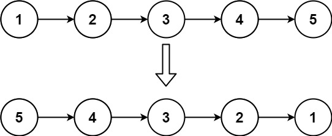
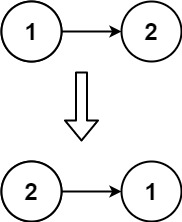

# 0206-Reverse LinkedList

### Problem Statement

Given the head of a singly linked list, reverse the list, and return the reversed list.

Example 1:

         

        Input: head = [1,2,3,4,5]
        Output: [5,4,3,2,1]

Example 2:

         

         Input: head = [1,2]
         Output: [2,1]

Example 3:
Input: head = []
Output: []

### Solutions

#### Intuition :

The problem is asking to reverse a singly-linked list. One common approach to reverse a linked list is to use recursion. The idea is to reverse the rest of the list and then move the current node to the end. The base case of the recursion is when the current node is null, in which case the head of the reversed list is set to the previous node.

#### Approach :

1.  The solve function is a recursive function that reverses the linked list. It takes three parameters: head (a reference to the head of the reversed list), prev (the previous node in the reversed list), and curr (the current node in the original list).

2.  If curr is null, it means we have reached the end of the original list. In this case, we set the head to prev, effectively updating the head of the reversed list, and return.

3.  Otherwise, we store the next node in a variable (nextNode) to prevent losing the reference to the rest of the list.

4.  We make a recursive call to solve with updated parameters: head remains the same, curr becomes the next node (nextNode), and prev becomes the current node (curr).

5.  After the recursive call, we update the next pointer of the current node (curr->next) to point to the previous node (prev), effectively reversing the link.

6.  The reverseList function is a wrapper function that checks if the list is empty or has only one element. If so, it returns the head unchanged. Otherwise, it calls the solve function to reverse the list and returns the updated head.

<Tabs>
    <TabItem value="cpp" label="C++" default>
      <SolutionAuthor name="@Ajay-Dhangar"/>
      ```cpp
      #include <iostream>

      // Definition for singly-linked list.
      struct ListNode {
          int val;
          ListNode *next;
          ListNode() : val(0), next(nullptr) {}
          ListNode(int x) : val(x), next(nullptr) {}
          ListNode(int x, ListNode *next) : val(x), next(next) {}
      };

      class Solution {
      public:
          void solve(ListNode* &head, ListNode* prev, ListNode* curr) {
              if (curr == nullptr) {
                  head = prev;
                  return;
              }
              ListNode* nextNode = curr->next;
              solve(head, curr, nextNode);
              curr->next = prev;
          }

          ListNode* reverseList(ListNode* head) {
              if (head == nullptr || head->next == nullptr) {
                  return head;
              }
              solve(head, nullptr, head);
              return head;
          }
      };

      // Helper function to print the linked list
      void printList(ListNode* node) {
          while (node != nullptr) {
              std::cout << node->val << " ";
              node = node->next;
          }
      }

      // Driver code
      int main() {
          Solution solution;
          ListNode* head = new ListNode(1);
          head->next = new ListNode(2);
          head->next->next = new ListNode(3);
          head->next->next->next = new ListNode(4);
          head->next->next->next->next = new ListNode(5);

          std::cout << "Original list: ";
          printList(head);

          head = solution.reverseList(head);

          std::cout << "\nReversed list: ";
          printList(head);

          return 0;
      }
      ```
    </TabItem>
    <TabItem value="java" label="Java">
      <SolutionAuthor name="@Ajay-Dhangar"/>
      ```java
      // Definition for singly-linked list.
      class ListNode {
          int val;
          ListNode next;
          ListNode() {}
          ListNode(int val) { this.val = val; }
          ListNode(int val, ListNode next) { this.val = val; this.next = next; }
      }

      public class Solution {
          public void solve(ListNode head, ListNode prev, ListNode curr) {
              if (curr == null) {
                  head = prev;
                  return;
              }
              ListNode nextNode = curr.next;
              solve(head, curr, nextNode);
              curr.next = prev;
          }

          public ListNode reverseList(ListNode head) {
              if (head == null || head.next == null) {
                  return head;
              }
              solve(head, null, head);
              return head;
          }

          public static void main(String[] args) {
              Solution solution = new Solution();
              ListNode head = new ListNode(1);
              head.next = new ListNode(2);
              head.next.next = new ListNode(3);
              head.next.next.next = new ListNode(4);
              head.next.next.next.next = new ListNode(5);

              System.out.print("Original list: ");
              printList(head);

              head = solution.reverseList(head);

              System.out.print("\nReversed list: ");
              printList(head);
          }

          // Helper function to print the linked list
          public static void printList(ListNode node) {
              while (node != null) {
                  System.out.print(node.val + " ");
                  node = node.next;
              }
          }
      }
      ```
    </TabItem>
    <TabItem value="python" label="Python">
      <SolutionAuthor name="@Ajay-Dhangar"/>
      ```python
      # Definition for singly-linked list.
      class ListNode:
          def __init__(self, val=0, next=None):
              self.val = val
              self.next = next

      class Solution:
          def solve(self, head: 'ListNode', prev: 'ListNode', curr: 'ListNode') -> None:
              if curr is None:
                  head[0] = prev
                  return
              nextNode = curr.next
              self.solve(head, curr, nextNode)
              curr.next = prev

          def reverseList(self, head: 'ListNode') -> 'ListNode':
              if head is None or head.next is None:
                  return head
              head_ref = [head]
              self.solve(head_ref, None, head)
              return head_ref[0]

      # Helper function to print the linked list
      def printList(node):
          while node:
              print(node.val, end=" ")
              node = node.next

      # Driver code
      if __name__ == "__main__":
          solution = Solution()
          head = ListNode(1)
          head.next = ListNode(2)
          head.next.next = ListNode(3)
          head.next.next.next = ListNode(4)
          head.next.next.next.next = ListNode(5)

          print("Original list: ", end="")
          printList(head)

          head = solution.reverseList(head)

          print("\nReversed list: ", end="")
          printList(head)
      ```
    </TabItem>
    <TabItem value="c" label="C">
      <SolutionAuthor name="@Ajay-Dhangar"/>
      ```c
      #include <stdio.h>
      #include <stdlib.h>

      // Definition for singly-linked list.
      struct ListNode {
          int val;
          struct ListNode *next;
      };

      void solve(struct ListNode** head, struct ListNode* prev, struct ListNode* curr) {
          if (curr == NULL) {
              *head = prev;
              return;
          }
          struct ListNode* nextNode = curr->next;
          solve(head, curr, nextNode);
          curr->next = prev;
      }

      struct ListNode* reverseList(struct ListNode* head) {
          if (head == NULL || head->next == NULL) {
              return head;
          }
          solve(&head, NULL, head);
          return head;
      }

      // Helper function to print the linked list
      void printList(struct ListNode* node) {
          while (node != NULL) {
              printf("%d ", node->val);
              node = node->next;
          }
      }

      // Driver code
      int main() {
          struct ListNode* head = (struct ListNode*)malloc(sizeof(struct ListNode));
          head->val = 1;
          head->next = (struct ListNode*)malloc(sizeof(struct ListNode));
          head->next->val = 2;
          head->next->next = (struct ListNode*)malloc(sizeof(struct ListNode));
          head->next->next->val = 3;
          head->next->next->next = (struct ListNode*)malloc(sizeof(struct ListNode));
          head->next->next->next->val = 4;
          head->next->next->next->next = (struct ListNode*)malloc(sizeof(struct ListNode));
          head->next->next->next->next->val = 5;
          head->next->next->next->next->next = NULL;

          printf("Original list: ");
          printList(head);

          head = reverseList(head);

          printf("\nReversed list: ");
          printList(head);

          return 0;
      }
      ```
    </TabItem>

</Tabs>

## Video lecture

<LiteYouTubeEmbed
    id="D2vI2DNJGd8"
    params="autoplay=1&autohide=1&showinfo=0&rel=0"
    title="CodeHarborHub Reverse Linkedlist"
    poster="maxresdefault"
    webp />
